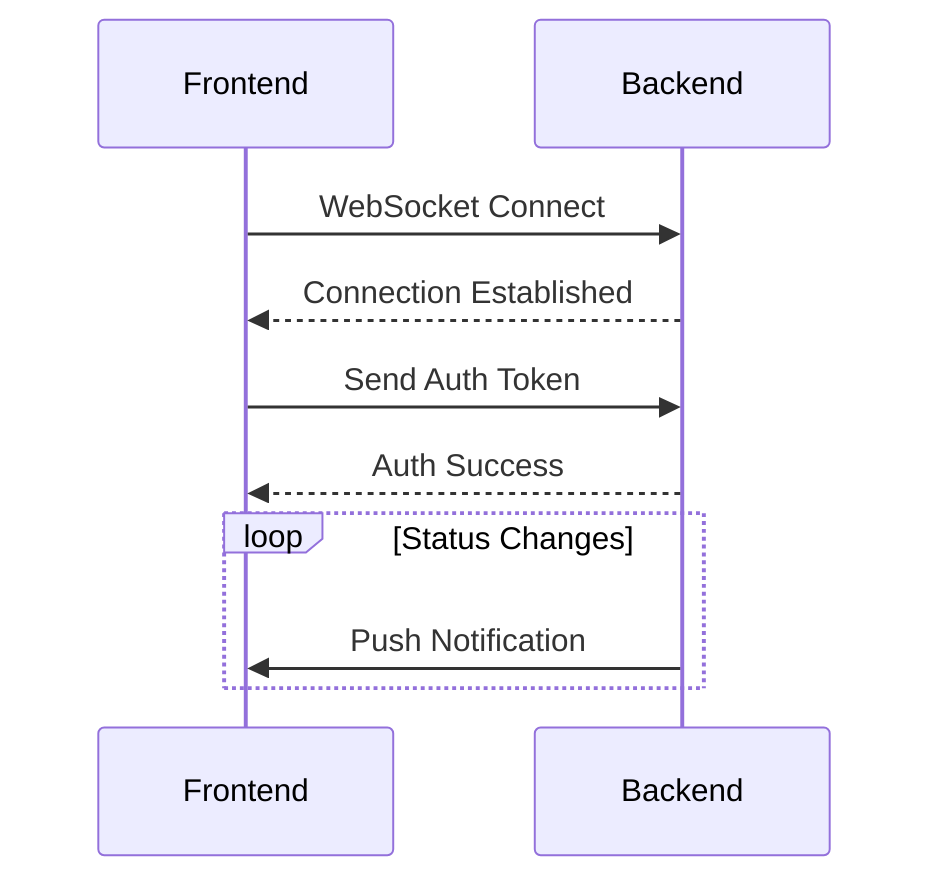

# Hướng dẫn tích hợp Realtime Notifications

## 1. Message Structure

### Authentication Message
```json
{
  "type": "AUTH",
  "payload": "<JWT_TOKEN>"
}
```

### Notification Payload
```json
{
  "id": 123,
  "type": "STATUS_CHANGE",
  "content": "Document status changed",
  "document": {
    "id": 456,
    "title": "Văn bản số 1234"
  },
  "createdAt": "2025-05-09T10:00:00Z",
  "read": false,
  "metadata": {
    "previousStatus": "DRAFT",
    "newStatus": "APPROVED"
  }
}
```

## 2. Sequence Flow



## 3. Error Handling

| Error Code | Message                     | Solution                     |
|------------|-----------------------------|------------------------------|
| 401        | Invalid credentials         | Refresh token                |
| 403        | Insufficient permissions    | Check user roles             |
| 429        | Too many requests           | Implement backoff strategy   |

## 4. Tích hợp theo loại thông báo

### 4.1 Status Change
```javascript
function handleStatusChange(notification) {
  const docId = notification.document.id;
  // Cập nhật UI
  updateDocumentStatus(docId, notification.metadata.newStatus);
  
  // Hiển thị toast
  showToast(`Trạng thái thay đổi: ${notification.metadata.previousStatus} → ${notification.metadata.newStatus}`);
}
```

### 4.2 Document Assignment
```javascript
function handleAssignment(notification) {
  // Thêm vào danh sách công việc
  addToTaskList({
    id: notification.document.id,
    title: notification.document.title,
    dueDate: notification.metadata.dueDate
  });
}
```

### 4.3 New Comment
```javascript
function handleNewComment(notification) {
  // Thêm comment vào section
  appendComment({
    author: notification.metadata.authorName,
    content: notification.metadata.commentText,
    timestamp: notification.createdAt
  });
}
```

### 4.4 Deadline Reminder
```javascript
function handleDeadline(notification) {
  // Hiển thị cảnh báo
  showAlert(`Sắp đến hạn xử lý: ${notification.document.title} (${notification.metadata.daysRemaining} ngày)`);
}
Phambanam99: #codebase phân tích chi tiết về thông báo trong ứng dụng này

GitHub Copilot: Okay, I will help you with that. I will start by analyzing the documentation you have about real-time notifications and then I will look for the relevant code. Okay, I will start by analyzing the notification functionality in this application.

First, I'll look for any documentation related to real-time notifications. Then, I'll search the codebase for the term "notification" to find relevant files and code snippets. This should give us a good overview of how notifications are implemented. Để phân tích chi tiết về hệ thống thông báo trong ứng dụng của bạn, tôi sẽ bắt đầu bằng cách tìm kiếm các cấu hình và trình xử lý WebSocket ở phía backend. Dựa trên tệp `docs/REALTIME_NOTIFICATIONS.md`, có vẻ như hệ thống sử dụng WebSocket để gửi thông báo thời gian thực.

Tôi sẽ tìm kiếm mã nguồn liên quan đến "WebSocket", "Notification", và các loại thông báo cụ thể như "STATUS_CHANGE" để xác định cách chúng được triển khai.

Bắt đầu với việc tìm kiếm các tệp cấu hình WebSocket. Chào bạn, để phân tích chi tiết về hệ thống thông báo trong ứng dụng, tôi sẽ tìm và tổng hợp các phần code có liên quan.

Dựa vào tệp `docs/REALTIME_NOTIFICATIONS.md`, hệ thống sử dụng WebSocket để gửi thông báo thời gian thực. Tôi sẽ bắt đầu bằng cách xem xét cấu hình WebSocket.

Tôi đã tìm thấy file cấu hình `WebSocketConfig.java` có chứa `WebSocketMessageBrokerConfigurer`, đây là một thành phần quan trọng trong việc thiết lập WebSocket với Spring.

Bây giờ, tôi sẽ đọc nội dung của file này để hiểu cách máy chủ WebSocket được cấu hình. Chào bạn, để phân tích chi tiết về hệ thống thông báo trong ứng dụng của bạn, tôi sẽ bắt đầu bằng cách xem xét tài liệu và cấu hình liên quan.

Dưới đây là tài liệu về thông báo thời gian thực, trong đó mô tả cấu trúc tin nhắn, luồng hoạt động và cách xử lý các loại thông báo khác nhau:

<file-contents path="c:\Users\NamP7\Documents\qlvb\backend-qlvb\docs\REALTIME_NOTIFICATIONS.md" />

Tiếp theo, đây là file cấu hình WebSocket, cho thấy cách ứng dụng thiết lập giao thức STOMP qua WebSocket để giao tiếp thời gian thực:

<file-contents path="c:\Users\NamP7\Documents\qlvb\backend-qlvb\src\main\java\com\managementcontent\config\WebSocketConfig.java" />

Từ hai file này, chúng ta có thể thấy rằng:
- Ứng dụng sử dụng WebSocket với STOMP để gửi thông báo thời gian thực.
- Endpoint để kết nối WebSocket là `/ws`.
- Các thông báo được gửi đến client qua topic `/topic`.
- Client gửi tin nhắn đến server qua prefix `/app`.
- Có nhiều loại thông báo được định nghĩa, ví dụ: `STATUS_CHANGE`, `DOCUMENT_ASSIGNMENT`, `NEW_COMMENT`, và `DEADLINE_REMINDER`.

Để hiểu rõ hơn về cách các thông báo này được tạo và gửi từ phía backend, tôi sẽ cần tìm các đoạn code sử dụng `SimpMessagingTemplate` để gửi tin nhắn đến message broker, cũng như các service và controller liên quan đến "Notification".I will now begin my analysis of the application's notification system.

First, I will search the codebase for keywords related to notifications to locate the core logic, such as controllers, services, and models. This will help me understand how notifications are processed on the backend. 

Phambanam99: @agent Try Again

GitHub Copilot: Okay, I will perform a detailed analysis of the notification functionality in this application.

First, I will search the workspace for files related to notifications to understand the implementation. Dựa trên kết quả phân tích mã nguồn và tài liệu của ứng dụng, hệ thống thông báo được xây dựng khá toàn diện, bao gồm các thành phần chính sau:

### 1. Cấu trúc cốt lõi của Thông báo (Notification)

Hệ thống thông báo xoay quanh các thành phần chính trong package `com.managementcontent.model` và `com.managementcontent.service`.

*   **Entity Notification.java**: Đây là model chính định nghĩa cấu trúc của một thông báo trong cơ sở dữ liệu.
    *   `id`: Mã định danh duy nhất.
    *   `type` (enum `NotificationType`): Loại thông báo.
    *   `content`: Nội dung chi tiết của thông báo.
    *   `createdAt`: Thời điểm tạo thông báo.
    *   `isRead`: Trạng thái đã đọc hay chưa.
    *   `user`: Người dùng nhận thông báo.
    *   `document`: Văn bản liên quan đến thông báo (nếu có).

*   **Enum NotificationType.java**: Định nghĩa các loại thông báo mà hệ thống có thể tạo ra:
    *   `STATUS_CHANGE`: Thay đổi trạng thái của văn bản.
    *   `DEADLINE_REMINDER`: Nhắc nhở khi sắp đến hạn xử lý.
    *   `NEW_DOCUMENT`: Có văn bản mới được tạo.
    *   `ASSIGNMENT`: Được giao xử lý một văn bản.
    *   `NEW_COMMENT`: Có bình luận mới trong văn bản.
    *   `DOCUMENT_UPDATE`: Thông tin văn bản được cập nhật.

*   **Repository NotificationRepository.java**: Cung cấp các phương thức truy vấn cơ sở dữ liệu cho `Notification`, bao gồm:
    *   `findByUser(User user, Pageable pageable)`: Lấy danh sách thông báo của người dùng theo phân trang.
    *   `countByUserIdAndReadFalse(Long userId)`: Đếm số lượng thông báo chưa đọc của người dùng.

### 2. Luồng tạo và gửi thông báo

*   **NotificationService.java**: Đây là service trung tâm, chịu trách nhiệm tạo và gửi thông báo.
    *   Phương thức `createAndSendNotification` là hạt nhân của service này. Nó nhận vào các tham số (`document`, `user`, `type`, `content`), tạo một đối tượng `Notification`, lưu vào cơ sở dữ liệu thông qua `NotificationRepository`, và sau đó gửi đi theo thời gian thực.

*   **Gửi thông báo Real-time**: Service sử dụng `SimpMessagingTemplate` để đẩy thông báo tới client thông qua WebSocket.
    *   Thông báo được gửi đến một kênh riêng của mỗi người dùng (`/queue/notifications`).
    *   Điều này cho phép giao diện người dùng (frontend) có thể nhận và hiển thị thông báo ngay lập tức mà không cần tải lại trang.

*   **Nguồn kích hoạt thông báo**:
    *   **DocumentWorkflowService.java**: Đây là nơi chính kích hoạt việc tạo thông báo. Ví dụ, khi trạng thái của một văn bản thay đổi (`changeDocumentStatus`), service này sẽ gọi `notificationService.createAndSendNotification` để thông báo cho người dùng liên quan.
    *   **DocumentEvent.java**: Hệ thống cũng sử dụng cơ chế sự kiện của Spring (`ApplicationEvent`). `DocumentEvent` được tạo ra cho các hành động như `STATUS_CHANGE`, `ASSIGNMENT`, `DOCUMENT_CREATED`. Rất có thể có một `EventListener` (không xuất hiện trong kết quả tìm kiếm) lắng nghe các sự kiện này và gọi `NotificationService` để gửi thông báo tương ứng.

### 3. Tích hợp phía Frontend và Real-time

Tài liệu REALTIME_NOTIFICATIONS.md cung cấp một hướng dẫn chi tiết cho việc tích hợp phía frontend:

*   **Cấu trúc tin nhắn (Message Structure)**: Định nghĩa rõ ràng cấu trúc JSON cho các tin nhắn WebSocket, bao gồm tin nhắn xác thực (AUTH) và payload của thông báo. Payload chứa đầy đủ thông tin cần thiết để hiển thị, như `id`, `type`, `content`, thông tin văn bản, và `metadata` (ví dụ: trạng thái cũ và mới).
*   **Luồng hoạt động (Sequence Flow)**: Mô tả quá trình kết nối WebSocket, xác thực, và nhận thông báo từ backend.
*   **Xử lý theo loại thông báo**: Cung cấp các đoạn mã JavaScript mẫu để xử lý từng loại thông báo khác nhau trên giao diện, ví dụ:
    *   `handleStatusChange`: Cập nhật trạng thái văn bản trên UI và hiển thị toast notification.
    *   `handleAssignment`: Thêm công việc mới vào danh sách của người dùng.
    *   `handleNewComment`: Hiển thị bình luận mới.
    *   `handleDeadline`: Hiển thị cảnh báo sắp đến hạn.

### 4. Truy xuất lịch sử thông báo

*   **NotificationController.java**: Cung cấp một API endpoint (`GET /api/notifications`) để người dùng có thể truy xuất lịch sử thông báo của mình.
*   API này trả về một danh sách thông báo đã được phân trang, cho phép client hiển thị lịch sử một cách hiệu quả.

### Tổng kết

Hệ thống thông báo được thiết kế theo kiến trúc hướng sự kiện và thời gian thực, tích hợp chặt chẽ với các quy trình nghiệp vụ chính (đặc biệt là quy trình xử lý văn bản). Việc sử dụng WebSocket giúp nâng cao trải nghiệm người dùng bằng cách cung cấp phản hồi tức thì. Tài liệu rõ ràng cũng là một điểm cộng, giúp cho việc phát triển và bảo trì phía frontend trở nên dễ dàng hơn.