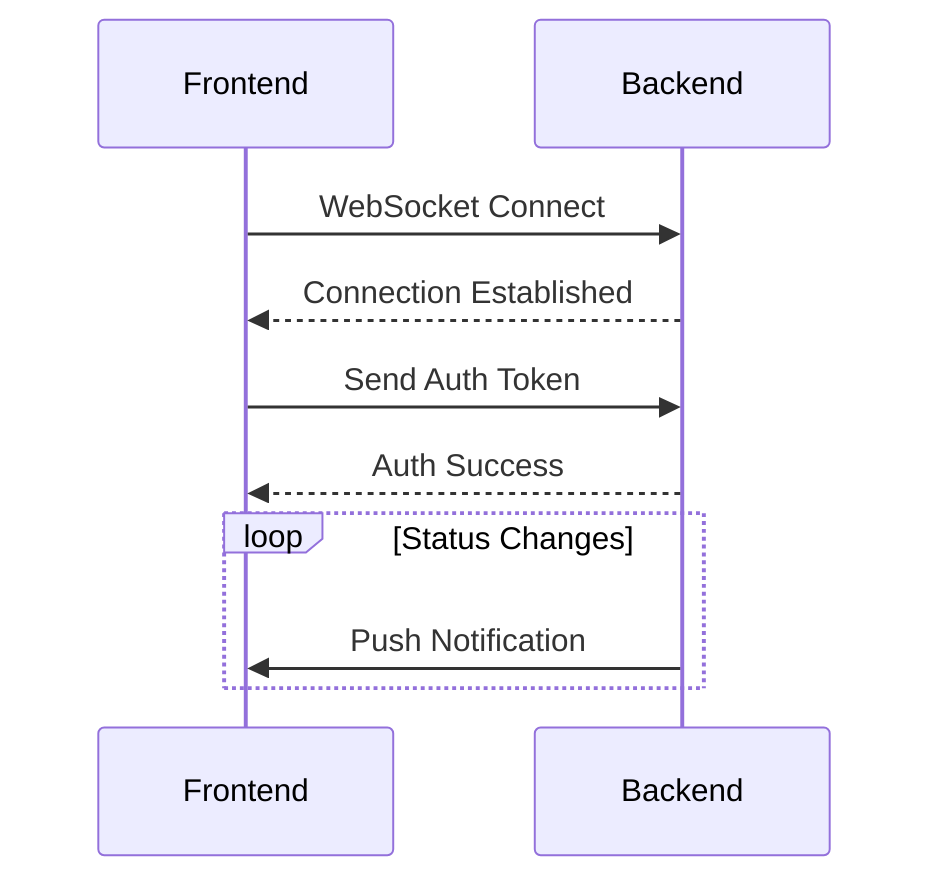

# Hướng dẫn tích hợp Realtime Notifications

## 1. Message Structure

### Authentication Message
```json
{
  "type": "AUTH",
  "payload": "<JWT_TOKEN>"
}
```

### Notification Payload
```json
{
  "id": 123,
  "type": "STATUS_CHANGE",
  "content": "Document status changed",
  "document": {
    "id": 456,
    "title": "Văn bản số 1234"
  },
  "createdAt": "2025-05-09T10:00:00Z",
  "read": false,
  "metadata": {
    "previousStatus": "DRAFT",
    "newStatus": "APPROVED"
  }
}
```

## 2. Sequence Flow



## 3. Error Handling

| Error Code | Message                     | Solution                     |
|------------|-----------------------------|------------------------------|
| 401        | Invalid credentials         | Refresh token                |
| 403        | Insufficient permissions    | Check user roles             |
| 429        | Too many requests           | Implement backoff strategy   |

## 4. Tích hợp theo loại thông báo

### 4.1 Status Change
```javascript
function handleStatusChange(notification) {
  const docId = notification.document.id;
  // Cập nhật UI
  updateDocumentStatus(docId, notification.metadata.newStatus);
  
  // Hiển thị toast
  showToast(`Trạng thái thay đổi: ${notification.metadata.previousStatus} → ${notification.metadata.newStatus}`);
}
```

### 4.2 Document Assignment
```javascript
function handleAssignment(notification) {
  // Thêm vào danh sách công việc
  addToTaskList({
    id: notification.document.id,
    title: notification.document.title,
    dueDate: notification.metadata.dueDate
  });
}
```

### 4.3 New Comment
```javascript
function handleNewComment(notification) {
  // Thêm comment vào section
  appendComment({
    author: notification.metadata.authorName,
    content: notification.metadata.commentText,
    timestamp: notification.createdAt
  });
}
```

### 4.4 Deadline Reminder
```javascript
function handleDeadline(notification) {
  // Hiển thị cảnh báo
  showAlert(`Sắp đến hạn xử lý: ${notification.document.title} (${notification.metadata.daysRemaining} ngày)`);
}